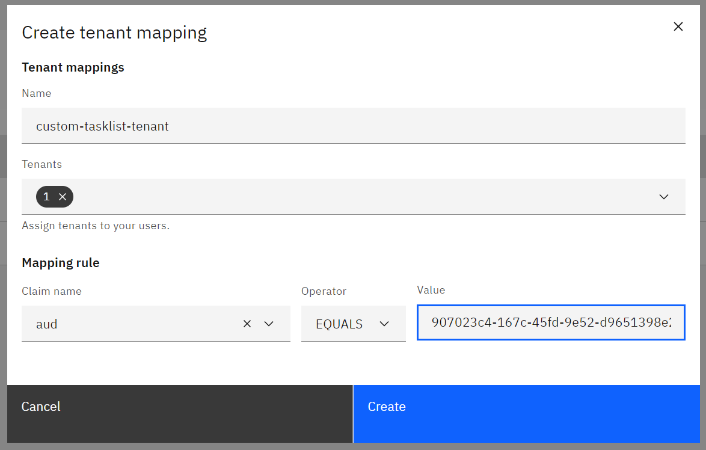
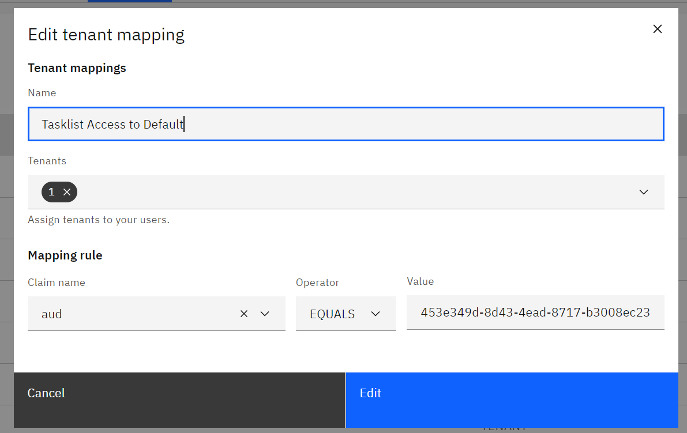

## Create App Registration

### Register a new app in the Azure Active Directory.

### Create a secret

### Role Mapping

Allow access to tasklist api.

### Tenant Mapping
Allow access to tenant

Same for Tasklist

