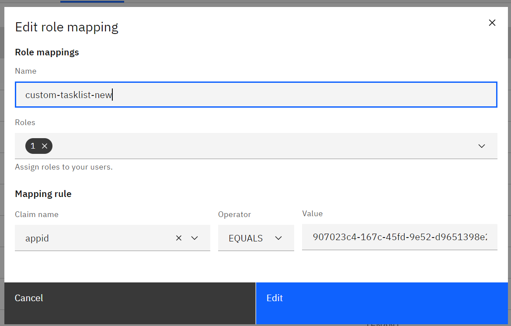

## Create App Registration

### Register a new app in the Azure Active Directory.


### Create a secret


### Role Mapping

Allow access to tasklist api.

### Tenant Mapping
Allow access to tenant


## Testing

### Get Access Token

```
curl -X POST https://login.microsoftonline.com/<tenantId>/oauth2/v2.0/token \
-H "Content-Type: application/x-www-form-urlencoded" \
-d "grant_type=client_credentials" \
-d "scope=<tasklist-app-id>/.default" \
-d "client_id=your_client_id" \
-d "client_secret=your_client_secret"
```

### Get Tasks

```
curl --location 'https://example.de/tasklist/v1/tasks/search' \
--header 'Content-Type: application/json' \
--header 'Authorization: Bearer token_from_call_a' \
--data '{}'
```

### Assign Task to non-existing User

```
curl --location --request PATCH 'https://example.de/tasklist/v1/tasks/<aTaskId/assign' \
--header 'Content-Type: application/json' \
--header 'Authorization: Bearer token_from_call_a' \
--data '{"assignee": "banabread"}'
```

### Complete Tasks

```
curl --location --request PATCH 'https://example.de/tasklist/v1/tasks/<aTaskId>/complete' \
--header 'Content-Type: application/json' \
--header 'Authorization: Bearer token_from_call_a' \
--data '{}'
```